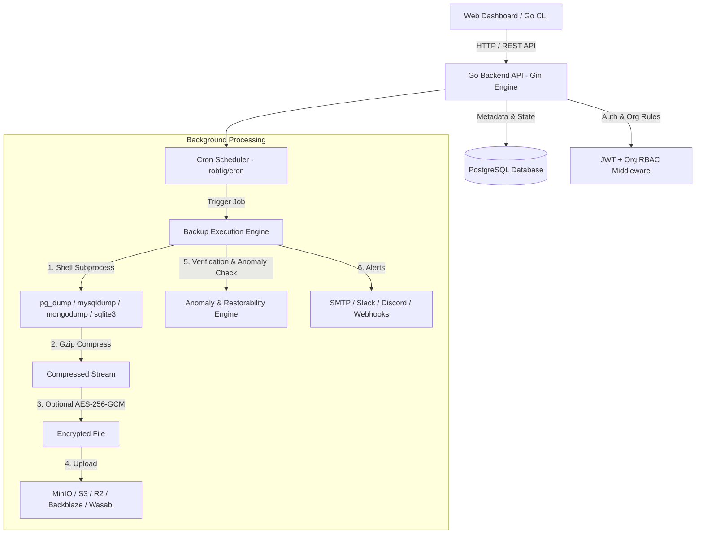

# SnapBase — Comprehensive Technical Architecture & Developer Guide

Welcome to the **SnapBase** engineering team! This guide provides a complete mental model of the codebase, covering architecture, database design, backup execution engines, security, authentication, API endpoints, CLI, background workers, and deployment setup.

---

## 1. System Architecture Overview

SnapBase is an open-source, multi-tenant SaaS database backup, restore, and sync platform. It allows teams to connect databases (PostgreSQL, MySQL, MongoDB, SQLite), configure cron schedules, encrypt artifacts, monitor backup health/anomalies, perform dry-run restores, and stream data across environments.



### Architecture Highlights
- **Monorepo Structure**:
  - `backend/`: Go 1.22 API server, scheduler, backup runner, billing engine, background workers.
  - `frontend/`: Next.js 14 App Router, React 18, Tailwind CSS, TypeScript dashboard.
  - `cli/`: Go 1.22 CLI powered by Cobra for terminal operation.
- **Stateless API + Distributed Storage**: All operational state is stored in PostgreSQL; raw backup binaries reside in S3-compatible object storage.
- **Isolated Subprocess Execution**: Database backups are executed using native client utilities (`pg_dump`, `mysqldump`, `mongodump`, `sqlite3`), piped through gzip compression, optionally encrypted with AES-256-GCM, and pushed directly to S3 storage providers.

---

## 2. Codebase Organization

```text
SnapBase/
├── backend/
│   ├── main.go               # Entry point: app initialization, background jobs, router setup
│   ├── audit/                # Audit logging helper
│   ├── backup/               # Core backup engine, runner, restore, verifier, anomaly detector, queue
│   ├── cmd/                  # CLI / helper entry points
│   ├── config/               # Environment configuration loader
│   ├── crypto/               # AES-256-GCM credential & file encryption routines
│   ├── handlers/             # Gin HTTP controllers (auth, connections, backups, schedules, etc.)
│   ├── insights/             # OpenAI schema analysis handlers
│   ├── middleware/           # Rate limiting, CORS, JWT Auth, Org Context
│   ├── models/               # SQL table schemas, migrations, GORM-like struct mappings, DB init
│   ├── notifications/        # Email (SMTP), Slack, Discord, and Lifecycle campaign engines
│   ├── rbac/                 # Role-based access control helpers
│   ├── retention/            # Backup retention policy cleanup background job
│   ├── scheduler/            # robfig/cron background scheduler
│   ├── storage/              # Storage abstraction (MinIO, S3, R2, Wasabi, B2)
│   ├── sync/                 # Production-to-staging database sync engine
│   └── webhooks/             # Custom webhook event dispatcher & history
├── frontend/
│   ├── src/
│   │   ├── app/              # Next.js App Router (Dashboard pages, Auth, Billing, Pricing, Status)
│   │   ├── components/       # UI components (shadcn/ui style, dialogs, charts, tables)
│   │   ├── hooks/            # Custom React hooks
│   │   └── lib/              # Utility functions, API fetch client
├── cli/
│   ├── main.go               # Cobra CLI entry point
│   ├── cmd/                  # CLI commands (login, backup, restore, connections, schedules, status)
│   └── internal/             # CLI internal packages (API client, local config manager)
├── docker-compose.yml        # Multi-container orchestration (Backend, Frontend, Postgres, MinIO)
└── README.md
```

---

## 3. Database Schema & Data Models

All application metadata is stored in PostgreSQL (`backend/models/db.go` and `backend/models/models.go`). Key entities include:

| Table Name | Description | Key Fields |
| --- | --- | --- |
| `users` | Primary user accounts | `id`, `email`, `password_hash`, `provider`, `avatar_url`, `referral_code` |
| `organizations` | Workspaces for team collaboration | `id`, `name`, `slug`, `owner_id` |
| `org_members` | Organization membership & roles | `id`, `org_id`, `user_id`, `role` (`owner`, `admin`, `editor`, `viewer`) |
| `db_connections` | Connected databases | `id`, `org_id`, `name`, `type`, `host`, `port`, `database_name`, `password_encrypted`, `retention_days`, `encryption_enabled` |
| `connection_permissions` | Fine-grained per-connection RBAC | `connection_id`, `org_member_id`, `can_view`, `can_backup`, `can_restore`, `can_manage` |
| `backup_jobs` | Log of all backup executions | `id`, `connection_id`, `schedule_id`, `status`, `size_bytes`, `storage_path`, `encrypted`, `verified` |
| `schedules` | Cron schedules for backups | `id`, `connection_id`, `cron_expression`, `enabled`, `last_run`, `next_run` |
| `storage_providers` | Custom S3 target buckets | `id`, `user_id`, `provider_type`, `endpoint`, `access_key`, `secret_key_encrypted`, `bucket`, `is_default` |
| `backup_hooks` | Pre / post backup triggers | `id`, `connection_id`, `hook_type` (`pre`/`post`), `hook_kind` (`sql`/`webhook`), `sql_script`, `webhook_url` |
| `anomalies` | Detected backup anomaly alerts | `id`, `connection_id`, `backup_job_id`, `type`, `message`, `severity`, `resolved` |
| `sync_jobs` / `sync_runs` | Database sync pipelines | `source_connection_id`, `target_connection_id`, `schedule`, `status` |
| `subscriptions` / `invoices` | Billing & payments | `user_id`, `plan`, `status`, `razorpay_subscription_id`, `trial_ends_at` |
| `webhooks` / `webhook_deliveries` | External event notifications | `org_id`, `url`, `secret`, `events`, `delivery history` |

---

## 4. Key Workflows & Engine Details

### A. Authentication & Workspace Context
1. **Password Auth**: Passwords are hashed with `bcrypt`.
2. **OAuth 2.0**: Native Google and GitHub OAuth 2.0 flows with state verification.
3. **JWT Tokens**: Signed with `JWT_SECRET`. API routes use `handlers.AuthMiddleware` to parse the token.
4. **Org Context Middleware**: `handlers.OrgContextMiddleware` automatically sets or creates the default organization context for the authenticated user and enforces workspace permissions.
5. **CLI Browser Authentication**:
   - `snapbase login` generates a random exchange code and poll token.
   - CLI opens `http://localhost:3001/cli-auth?code=...`.
   - Browser displays approval prompt. Once confirmed, backend associates JWT with poll token.
   - CLI receives token via polling `/api/cli/auth/poll/:token` and saves credentials locally to `~/.snapbase/config.json`.

### B. Backup Execution Engine (`backend/backup/runner.go`)
1. **Triggering**: Triggered manually via API/CLI or automatically by `scheduler`.
2. **Pre-hooks**: Runs optional pre-backup SQL scripts or HTTP hooks.
3. **Execution & Retry**:
   - Retries up to 3 times with exponential backoff (`0s`, `5s`, `15s`).
   - Executes native tools (`pg_dump`, `mysqldump`, `mongodump`, or `sqlite3`) writing directly into a gzipped temp file.
4. **Encryption Layer**: If connection encryption is enabled, encrypts the gzipped dump using AES-256-GCM with a decrypted key from `db_connections.encryption_key_encrypted`.
5. **S3 Storage Upload**: Uploads to the connection's designated S3 storage provider using multi-part upload / retries.
6. **Post-hooks & Verification**: Runs post-backup hooks, anomaly detection algorithms, and dispatches webhook/email/Slack notifications.

### C. Restorability Verification Engine (`backend/backup/restorability.go`)
- Background hourly worker scans recent successful backups.
- Downloads the backup artifact, decrypts it (if encrypted), decompresses it, and performs a dry-run test restore into a temporary database to guarantee that backup artifacts are 100% restorable.

### D. Automated Anomaly Detection (`backend/backup/anomaly.go`)
- Evaluates backup artifact file size against historical moving averages.
- Flags anomalies if size drops below `0.5x` (data loss risk) or spikes above `3.0x` (unexpected data inflation), creating an alert record and sending notification warnings.

### E. Database Sync Engine (`backend/sync/runner.go`)
- Enables production-to-staging schema & data replication.
- Performs a live backup on the `source_connection_id`, streams the artifact, and executes an automated restore process into the `target_connection_id`.

---

## 5. Security & Cryptography Model

- **Credential Encryption**: Database passwords and S3 secret keys are encrypted at rest using AES-256-GCM via `crypto.Encrypt()` (`backend/crypto/aes.go`). They are never exposed over API responses (`json:"-"`).
- **Backup Artifact Encryption**: Support for symmetric file encryption before object store transmission using PBKDF2 key derivation and AES-256-GCM (`backend/crypto/backup_encryption.go`).
- **Rate Limiting**:
  - Global API endpoints: `60 req/min` per IP (`middleware.RateLimit()`).
  - Auth endpoints: `10 req/min` per IP (`middleware.RateLimitAuth()`).

---

## 6. Background Jobs Overview

`backend/main.go` registers several asynchronous background Goroutines:

1. **Password Reset Token Cleanup**: Runs hourly; purges expired reset tokens.
2. **Lifecycle Email Campaigns**: Runs hourly; sends automated welcome and onboarding emails (day 1, 3, 7, 13).
3. **Weekly Digest Emails**: Runs hourly; dispatches activity summaries every Monday at 09:00 UTC.
4. **Storage Overage Calculation**: Runs daily; records monthly storage usage peaks and calculates overage fees ($0.05/GB).
5. **Verified Restorability Worker**: Runs hourly; performs test restores on unverified backups.
6. **Uptime Monitoring**: Runs every 60 seconds; logs system health for `/api/status`.
7. **Trial Expiration Cleaner**: Runs hourly; downgrades expired trial accounts to the free tier.

---

## 7. Developer Onboarding Checklist

To spin up and work on SnapBase locally:

```bash
# 1. Clone repository
git clone https://github.com/suguslove10/SnapBase.git
cd SnapBase

# 2. Setup environment configuration
cp .env.example .env

# 3. Spin up PostgreSQL and MinIO using Docker Compose
docker compose up -d postgres minio

# 4. Start backend server
cd backend
go run main.go

# 5. Start frontend server (in another terminal)
cd frontend
npm install
npm run dev

# 6. Build and test Go CLI (in another terminal)
cd cli
make build
./dist/snapbase status
```

- Local Dashboard: `http://localhost:3001`
- Local Backend API: `http://localhost:8080`
- Admin Credentials: `admin@snapbase.local` / `admin123`
